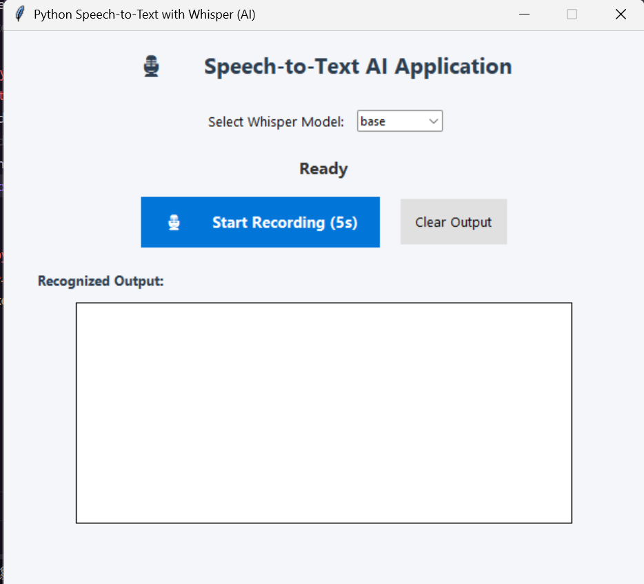

# 🎙️ Python Speech-to-Text with OpenAI Whisper

An end-to-end AI-powered Speech-to-Text desktop application built using Python, OpenAI Whisper, sounddevice, and Tkinter GUI.


---

## 📸 GUI Application Interface

Below is the working demonstration of the desktop GUI:



### 🌟 Key Features
- **🎙️ Real-time Audio Capture:** Uses `sounddevice` to capture clean 16kHz audio from the microphone.
- **🧠 Neural Network Inference:** Powered by OpenAI's Whisper pre-trained model for speech recognition.
- **⏱️ Time-Aligned Transcripts:** Generates exact sentence timestamps `[start_time -> end_time]`.
- **💻 Desktop GUI:** Built with Tkinter featuring real-time status updates (Recording, Transcribing, Completed).
- **📊 Dataset Collection:** Includes automated voice dataset collection tools (`create_dataset.py`) and WER evaluation tools.

---

## 🏗️ Architecture & Pipeline

```text
[Speaker Voice]
      │
      ▼
 [Microphone]
      │
      ▼
[sounddevice] (16kHz PCM Audio)
      │
      ▼
[Audio WAV Buffer]
      │
      ▼
[OpenAI Whisper Neural Network] (Inference)
      │
      ▼
[Recognized Text + Timestamps]
      │
      ▼
[Tkinter Desktop GUI Display]
```

---

## 📁 Repository Structure

```text
├── app_gui.py           # Desktop GUI Application (Tkinter)
├── voice_to_text.py     # Command-line Speech-to-Text pipeline
├── record.py            # Audio recording utility
├── transcribe.py        # Audio file transcription utility
├── create_dataset.py    # Automated dataset creator for voice fine-tuning
├── evaluate_dataset.py  # Word Error Rate (WER) evaluation script
├── my_dataset/          # 10 custom speech recordings + metadata.csv
├── README.md            # GitHub documentation
└── README.txt           # Classroom practical documentation
```

---

## 🚀 Quick Start Guide

### 1. Clone the repository
```bash
git clone https://github.com/srkamd/speech-to-text-whisper.git
cd speech-to-text-whisper
```

### 2. Create and Activate Virtual Environment
```powershell
python -m venv speechtotext
.\speechtotext\Scripts\activate
```

### 3. Install Dependencies
```bash
pip install openai-whisper sounddevice scipy
```

### 4. Run the GUI Application
```bash
python app_gui.py
```

Click **"🎙️ Start Recording"**, speak into your microphone, and observe the live transcription and timestamps!

---

## 💡 AI Concepts Demonstrated
1. **Pre-trained Models vs Training from Scratch:** Utilizing models pre-trained on 680,000+ hours of speech.
2. **Inference vs Training:** Running forward inference on CPU without modifying weights.
3. **Word Error Rate (WER):** Evaluating transcription accuracy against ground-truth datasets.
4. **Whisper Model Sizes:** Comparing `tiny` (fast/lightweight) vs `base` models.

---

## 👤 Author
- **GitHub:** [@srkamd](https://github.com/srkamd)
